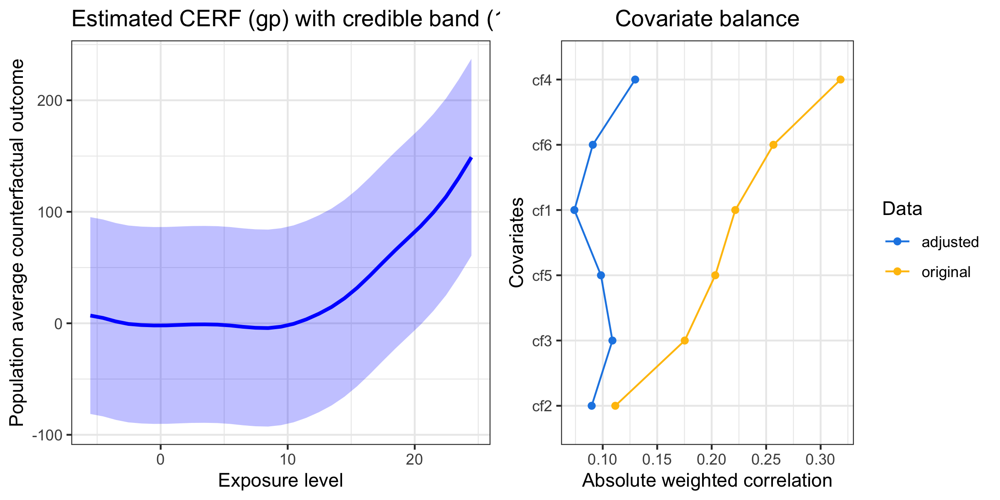
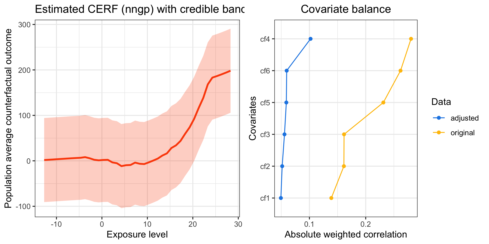

| Resource    |  Github Actions      |  Code Coverage  |
| ----------  | -------------------- | --------------- |
| Platforms   | Windows, macOS, Linux|    codecov      |
| R CMD check | [](https://github.com/NSAPH-Software/GPCERF/actions) | [](https://app.codecov.io/gh/NSAPH-Software/GPCERF) |


# Gaussian processes for the estimation of causal exposure-response curves (GP-CERF)

## Summary
Gaussian Process (GP) and nearest neighbor Gaussian Process (nnGP) approachs for nonparametric modeling. 

## Installation

```r
library("devtools")
install_github("NSAPH-Software/GPCERF", ref="develop")
library("GPCERF")
```

## Usage

### GP

```r
library(GPCERF)
set.seed(781)
sim_data <- generate_synthetic_data(sample_size = 500, gps_spec = 1)

n_core <- 1

m_xgboost <- function(nthread = n_core, ...) {
  SuperLearner::SL.xgboost(nthread = nthread, ...)
}

m_ranger <- function(num.threads = n_core, ...){
  SuperLearner::SL.ranger(num.threads = num.threads, ...)
}

# Estimate GPS function
GPS_m <- estimate_gps(cov_mt = sim_data[,-(1:2)],
                      w_all = sim_data$treat,
                      sl_lib = c("m_xgboost", "m_ranger"),
                      dnorm_log = TRUE)

# exposure values
q1 <- stats::quantile(sim_data$treat, 0.05)
q2 <- stats::quantile(sim_data$treat, 0.95)

w_all <- seq(q1, q2, 1)

params_lst <- list(alpha = 10 ^ seq(-2, 2, length.out = 10),
                   beta = 10 ^ seq(-2, 2, length.out = 10),
                   g_sigma = c(0.1, 1, 10),
                   tune_app = "all")

cerf_gp_obj <- estimate_cerf_gp(sim_data,
                                w_all,
                                GPS_m,
                                params = params_lst,
                                nthread = n_core)
summary(cerf_gp_obj)
plot(cerf_gp_obj)
```
```
GPCERF Full Gaussian Process exposure rate function object

Optimal hyper parameters(#trial: 60): 
  alpha = 100   beta = 10   g_sigma = 0.01

Optimal covariate balance: 
  cf1 = 0.074 
  cf2 = 0.090 
  cf3 = 0.109 
  cf4 = 0.130 
  cf6 = 0.091 
  cf5 = 0.098

Original covariate balance: 
  cf1 = 0.222 
  cf2 = 0.112 
  cf3 = 0.175 
  cf4 = 0.318 
  cf6 = 0.257 
  cf5 = 0.203
            ----***----   
```

<p>

</p>


### nnGP

```r
set.seed(967)
sim_data <- generate_synthetic_data(sample_size = 10000, gps_spec = 1)
sim_data$cf5 <- as.factor(sim_data$cf5)

m_xgboost <- function(nthread = 12, ...) {
  SuperLearner::SL.xgboost(nthread = nthread, ...)
}

# Estimate GPS function
GPS_m <- estimate_gps(cov_mt = sim_data[,-(1:2)],
                      w_all = sim_data$treat,
                      sl_lib = c("m_xgboost"),
                      dnorm_log = TRUE)

# exposure values
w_all <- seq(min(sim_data$treat)+1, max(sim_data$treat)-1, 1)

cerf_nngp_obj <- estimate_cerf_nngp(sim_data,
                                    w_all,
                                    GPS_m,
                                    params = list(alpha = c(0.01, 0.1, 1,
                                                            2, 3, 4, 8, 16),
                                                  beta = c( 10, 100, 200),
                                                  g_sigma = c(0.0001, 0.001,
                                                              0.01, 0.1),
                                                  tune_app = "all",
                                                  n_neighbor = 100,
                                                  block_size = 1e3),
                                  nthread = 12)


summary(cerf_nngp_obj)
plot(cerf_nngp_obj)
```

```
GPCERF Nearest Neighbore Gaussian Process exposure rate function object summary

Optimal hyper parameters(#trial: 96): 
  alpha = 16   beta = 200   g_sigma = 1e-04

Optimal covariate balance: 
  cf1 = 0.049 
  cf2 = 0.052 
  cf3 = 0.056 
  cf4 = 0.102 
  cf6 = 0.060 
  cf5 = 0.059

Original covariate balance: 
  cf1 = 0.139 
  cf2 = 0.161 
  cf3 = 0.162 
  cf4 = 0.280 
  cf6 = 0.262 
  cf5 = 0.231
            ----***----         
```

<p>

</p>

## References

Ren, B., Wu, X., Braun, D., Pillai, N. and Dominici, F., 2021. Bayesian modeling for exposure response curve via gaussian processes: Causal effects of exposure to air pollution on health outcomes. arXiv preprint arXiv:2105.03454.
