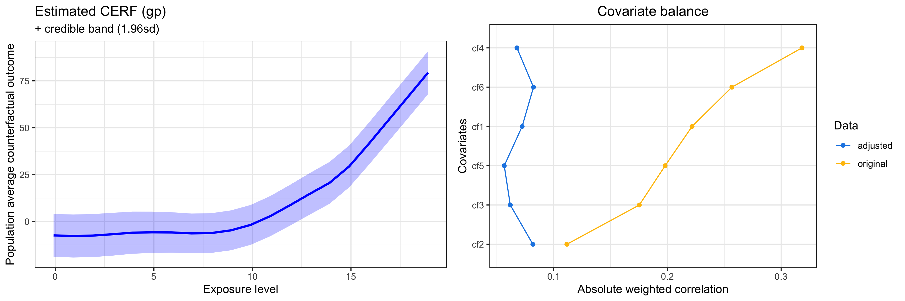

# Summary

We present the GPCERF R [e.g., @R_2022] package, which employs a novel Bayesian approach based on Gaussian Process (GP) to estimate the causal exposure-response function (CERF) for continuous exposures, along with associated uncertainties. R packages that target at these causal effects under a binary exposure setting exist [e.g., @MatchIt_R], as well as in the continuous exposure setting [@CausalGPS_R]. However, they often rely on a separate resampling stage to quantify uncertainty of the estimates, which can be computationally demanding. GPCERF provides a two-step end-to-end solution for causal inference with continuous exposures that is equipped with automatic and efficient uncertainty quantification. During the first step (design phase), the algorithm searches for optimal hyperparameters (using the exposures and covariates) that yield the optimal covariate balance, allowing for the creation of a balanced data set. The selected hyperparameters are then used in the second step (analysis phase) to estimate the CERF on the balanced data set and its associated uncertainty using two different types of GPs: a standard GP and a nearest-neighbor GP (nnGP). Standard GP offers high accuracy in estimating CERF but is also computationally intensive. The nnGP is a computationally efficient approximation of the standard GP and is well-suited for the analysis of large-scale dataset. 

# Statement of need

Existing R packages for estimating causal exposure response curve of continuous exposures usually requires resampling approaches, such as boostrap, to obtain uncertainty of the estimates [e.g., @CausalGPS_R]. However, when the number of observations is large, resampling based algorithms can be computationally expensive. To address this gap, we have implemented a novel Bayesian approach that uses Gaussian Processes (GPs) prior for the counterfactual outcome surfaces to enable flexible estimation of CERF. By leveraging the posterior distributions of the model parameters, we can automatically quantify the uncertainty of the estimated CERF [for more details see @Ren_2021_bayesian]. Since standard GPs are notorious for its lack of scalability due to the operations involving inversion of the covariance matrices, we have also added in our approach a nearest-neighbour GP (nnGP) prior to achieve computationally efficient inference of CERF when dealing with large-scale datasets.

# Overview

In the context of causal inference for continuous exposure, the main target for inference is the so-called casual exposure response function (CERF), which is defined as the expectation of the counterfactual outcomes over a range of exposure levels in a given population. If we denote the counterfactual outcome at exposure level $w$ by $Y(w)$, CERF is indeed the function $R(w) = \mathbb E(Y(w))$ defined on a set of $w$ of interest. One should be careful when extracting CERF from observational data, which usually contain not only the outcome $Y$ and exposure $W$, but also potential confounders $C$. The main reason is that the confounders $C$ leads to biased inference of $R(w)$ if not adjusted properly, such as through a simple regression model. We choose to follow the approach in @Hirano_2004, which is based on generalized propensity score (GPS), in this package to handle this issue. GPS, denoted by $s(W,C)$, is defined as the conditional density of $W$ given $C$. It has been shown that one can obtain an unbiased estimator of the causal effect of $W$ provided the conditional distribution of $Y$ given $W$ and $s(W,C)$ is known @Hirano_2004.

In the GPCERF package, we use a Gaussian process (GP) prior for the conditional distribution of $Y$ given $W$ and $s(W,C)$. This model implicitly performs non-parametric regression of $Y$ on $W$ and $s(W,C)$, and thus we can recover $p(Y|W, s(W,C))$ with high accuracy by using the posterior mean of the model parameters. We assume that the kernel function of the Gaussian Process is
$$
k((w, c),(w', c')) = \gamma^2h(\sqrt{\frac{(s(w, c)-(s(w', c'))^2}{\alpha}+\frac{(w - w')^2}{\beta}}),
$$
where $h : [0, \infty) \rightarrow [0, 1]$ is a non-increasing function; and $\alpha$ and $\beta$ define the relative importance of GPS and exposure values, respectively. $\gamma$ indicates the scale of the GP. We call the collection $(h, \alpha, \beta, \gamma)$ the hyper-parameters of the GP.

The primary goal in GPCERF is to find appropriate values for the hyper-parameters. In the context of causal inference, the "appropriate" means that the hyper-parameters make the process of inference as if it is conducted for a dataset that is generated under randomized design. To be more concrete, note that the GP estimates $R(w)$ by creating a pseudo-population that is a weighted version of the original dataset [see more details in @Ren_2021_bayesian]. The weight for each sample in the original dataset is a function of the hyperparameters. By tuning the hyperparameters, we can minimize the sample correlations between $W$ and each component of $C$ in this pseudo-population, rendering the pseduo-population to be a sample from a randomized design. In practice, we minimize a summary of the sample correlations between $W$ and each of $C$, referred to as covariate balance, to tune our hyper-parameters. The correlation between $W$ and $C$ in the pseudo-population is computed using the _wCorr_ R package [@wCorr_R].

Both GP and nnGP approaches involve two primary steps - tuning and estimation. The kernel function is selected in the beginning by the user, and the program conducts a grid search on the range of provided $\alpha$, $\beta$, and $\frac{\gamma}{\sigma}$. During the tuning step,  covariate balance is minimized by choosing the optimal hyperparameters. In the estimation step, the optimal parameters are used to estimate the posterior mean and standard deviation of $R(w)$ at a set of exposure values of interest. The outcome data is not used during the tuning step, distinguishing the design and analysis phases. @Ren_2021_bayesian discusses the  implemented approaches in detail. In the following we provide an example for running the package for each implemented models.

## Example 1: Standard GP models

To compute the causal exposure response function, one can use the `etimate_cerf_gp()` function. The following example demonstrates how to use this function, along with some discussion.

```r
library(GPCERF)

set.seed(781)
# Generate synthetic data with 500 data samples.
sim_data <- generate_synthetic_data(sample_size = 500, 
                                    gps_spec = 1)

# SuperLearner internal libraries' wrapper.
m_xgboost <- function(nthread = 12, ...) {
  SuperLearner::SL.xgboost(nthread = nthread, ...)
}

m_ranger <- function(num.threads = 12, ...){
  SuperLearner::SL.ranger(num.threads = num.threads, ...)
}

# Estimate GPS function
gps_m <- estimate_gps(cov_mt = sim_data[, paste0("cf", seq(1,6))],
                      w_all = sim_data$treat,
                      sl_lib = c("m_xgboost", "m_ranger"),
                      dnorm_log = TRUE)

# exposure values of interest
# We trim the exposure level to satisfy positivity assumption to avoid including
# extreme exposure values.
q1 <- stats::quantile(sim_data$treat, 0.05)
q2 <- stats::quantile(sim_data$treat, 0.95)
w_all <- seq(q1, q2, 1)

# Hyperparameters' range for grid search to find optimal hyperparameters
params_lst <- list(alpha = 10 ^ seq(-2, 2, length.out = 10),
                   beta = 10 ^ seq(-2, 2, length.out = 10),
                   g_sigma = c(0.1, 1, 10),
                   tune_app = "all")

# Estimate exposure response function
cerf_gp_obj <- estimate_cerf_gp(sim_data,
                                w_all,
                                gps_m,
                                params = params_lst,
                                nthread = 12)

```
In this example, we generated a synthetic dataset of 500 observations and six covariates. We then developed a wrapper function to modify the number of threads in the SuperLearner package @SuperLearner_R. We estimated the GPS values using these wrapper functions. One can read more details by running `?GPCERF::estimate_gps` in R. To compute the posterior mean and standard deviation of $R(w)$, we need to provide the range of exposure values of interest and a range of hyperparameters that will be examined as additional input and parameters. Further details can be found in `?GPCERF::estimate_cerf_gp`. The function outputs an `S3` object, which can be further investigated using generic functions, as shown below.

```r
summary(cerf_gp_obj)  
```

```
GPCERF standard Gaussian grocess exposure response function object

Optimal hyper parameters(#trial: 300): 
  alpha = 12.9154966501488   beta = 12.9154966501488   g_sigma = 0.1

Optimal covariate balance: 
  cf1 = 0.072 
  cf2 = 0.082 
  cf3 = 0.062 
  cf4 = 0.068 
  cf5 = 0.056 
  cf6 = 0.082

Original covariate balance: 
  cf1 = 0.222 
  cf2 = 0.112 
  cf3 = 0.175 
  cf4 = 0.318 
  cf5 = 0.198 
  cf6 = 0.257
            ----***----     
```
As one can see, as part of the grid search, 300 different combination of hyper parameters have been tried. \autoref{fig:gp} shows the causal exposure response function and achieved covariate balance in this simulated example.


{ width=80% }


# References
